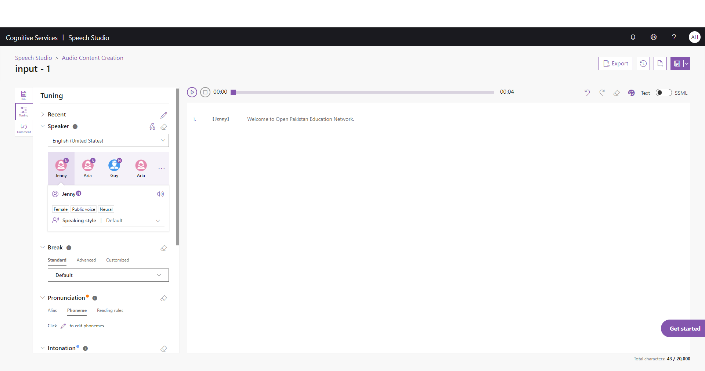
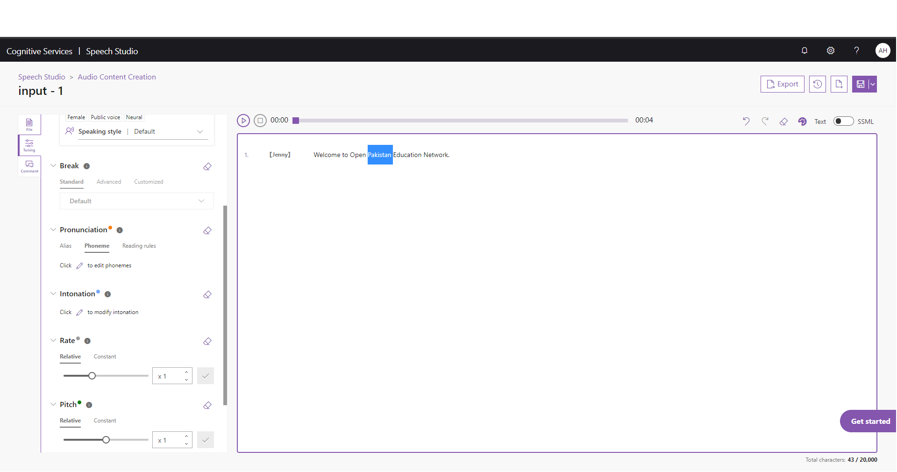
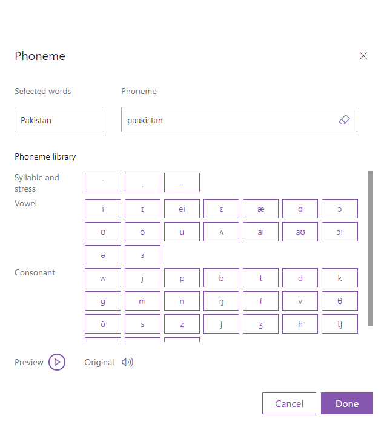

# Audio Content Creation using Microsoft Cognitive Services and Speech Studio
## Why?
_**Custom Development:**_ Developers typically write a Windows Forms or Console Application using C# to call the Microsoft Cognitive Services Speech API to generate audio utterances for their applications; refer to code in the _'Samples-Http'_ folder [here](https://github.com/Microsoft/Cognitive-Speech-TTS).
## What?
_**No Code:**_ The approach used by OPEN (Open Pakistan Education Network) and illustrated visually below, uses a no-code approach offered by the Speech Studio web site to create audio content for its knowledge content, so that Pakistani learners can get a clear Neural voice and not a robot-sounding voice in their courses.

## How?
*The steps assume that you have public access to a Microsoft cloud subscription using the Azure Portal.*
1. Go to the [Speech Studio](http://speech.microsoft.com) web site and log in using your credentials.
1. On the _'Audio Content Creation'_ page, click the _'Upload'_ button, select the text file (by clicking the _'Browse files...'_ button on the _'Upload file'_ dialog, navigating to the local .txt file, selecting it), check the _'Split input script...'_ checkbox, and click _'Next'_.
1. On the _'Split files'_ dialog, select the _'By paragraphs'_ radio-button, and click _'Upload'_. You can view the uploaded text file [here](files/input.txt).
1. Click the _'input - 1'_ link.

*The 'Audio Content Creation'* page will appear.*
1. Select a voice of your choice (Neural voices are represened by an 'N' in the icon). For this demo, I have selected _'Jenny'_.
1. Select a _'Speaking style'_ from the options in drop-down list; either _'Assistant'_, _'Chat'_, _'Customer Service'_. _'Newscast'_, or _'Default'_.

1. Highlight _Pakistan_ in the top-center of the page by selecting it with your mouse cursor.

1. Scroll down the left settings frame, and click the _'Edit'_ button (represened by the Pencil icon) under the _'Pronunciation'_ heading.
1. In the _'Phoneme'_ dialog, type _paakistan_ in the _Phoneme_ text-box, and click _'Done'_. You can hear your changes to the audio by clicking the _'Preview'_ icon anytime.

1. Highlight _Welcome to Open Pakistan Education Network_ in the top-center of the page by selecting it with your mouse cursor.
1. Click the _'Edit'_ button (represened by the Pencil icon) under the _'Intonation'_ heading.
1. In the _'Edit intonation'_ dialog, modify the wave-form to represent your brand, and click _'Done'_.

1. To save your changes, click the _Save_ icon on the top-right corner of your screen.
1. Return to the _'Audio Content Creation'_ page by clicking the bread-crumb.
1. On the _'Audio Content Creation'_ page, select the files you want to export using the checkbox next to each name.
1. After you have selected one or more files, click the _'Export'_ button at the top.
1. On the _'Export'_ dialog, select _'Export to Audio Library (Recommended)'_, and click _'Next'_.
1. After you click _'Next'_, you will be taken to the _'Export to Audio Library'_ dialog. Select WAV or MPs quality from the dropdown list.
1. Make sure the _'Each file generates a piece of audio'_ radio is selected. Hit the _'Export'_ button.
